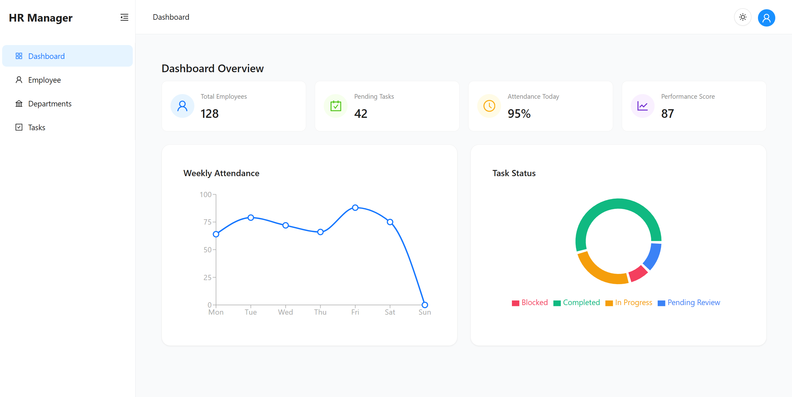

# 📑 HR Manager Frontend

A clean, modern React web application for Human Resources management. Allows admins to manage employees, departments, and tasks securely with JWT authentication. Built for easy integration with a backend REST API.

## ✨ Technology Stack

- React 18+ (Vite-powered)  
- JavaScript (ES6+)  
- Redux Toolkit & RTK Query  
- React Router v6  
- Tailwind CSS (with Dark Mode support)  
- JWT Authentication (Bearer tokens)  

## 🚀 Features

- Secure admin login and logout with JWT  
- Full CRUD for employees, departments, and tasks  
- Pagination and search on employee and task lists  
- Protected routes allowing only authenticated access  
- Dark mode support with theme toggling  
- Modular, reusable UI components (tables, forms, modals)  

## 🛠️ Development Details

- API requests use Redux Toolkit Query with auto cache management  
- Authentication tokens automatically attached to API calls  
- Responsive design optimized for desktops and tablets  
- Dark mode implemented using Tailwind CSS’s class-based strategy  
- Domain-driven folder structure for maintainability  

## ⚠️ Known Limitations

- No role-based authorization yet — all logged-in users have admin rights  


## 🚦 Getting Started

1. Clone the repo:  
   ```bash
   git clone https://github.com/ali-ayad/HR-Manager-Front.git


